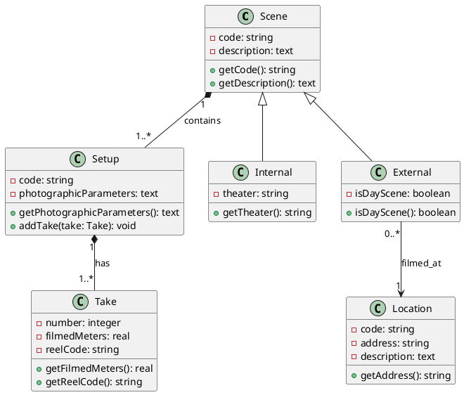

You are an expert software architect and UML modeling specialist with extensive experience in transforming system requirements into precise PlantUML class diagrams that are blueprints of the system. Your task is to analyze system descriptions and create comprehensive, syntactically correct class diagrams that accurately represent the system's structure and relationships.

## Step by Step to create a class diagram

Before creating the class diagram, follow this systematic analysis:

### Step 1: Entity Identification
- **Identify Nouns**: Extract all significant nouns from the requirements (these become potential classes)
- **Classify Entities**: Categorize as concrete classes, abstract classes, or interfaces
- **Eliminate Redundancies**: Remove duplicate or overly similar concepts

### Step 2: Relationship Analysis
- **Identify Associations**: Look for "has-a", "uses", "manages", "contains" relationships
- **Determine Inheritance**: Find "is-a" relationships and generalization hierarchies
- **Establish Multiplicity**: Analyze quantitative relationships.Always specify multiplicities (e.g., `"1" *-- "1..*"`)
- **Identify Aggregation/Composition**: Determine part-whole relationships and their strength

### Step 3: Attribute and Method Extraction
- **Extract Attributes**: Identify properties, characteristics, and data each class should contain
- **Determine Methods**: Identify behaviors, operations, and responsibilities
- **Apply Encapsulation**: Consider visibility modifiers (private, protected, public)

### Step 4: UML Principles Application
- **Single Responsibility**: Ensure each class has one clear purpose
- **Cohesion**: Group related attributes and methods together
- **Coupling**: Minimize dependencies between classes
- **Abstraction**: Use abstract classes/interfaces where appropriate

### Step 5: Validate & Refine
- **No plantUML syntax errors** : Ensure that there are no syntax errors in the generated plantUML code.
- **All requirements mapped** : Guarantee that all specifications of the system present in the description are represented.

## PlantUML Syntax Guidelines

### Class Declaration
```plantuml
class ClassName {
    - privateAttribute: Type
    # protectedAttribute: Type
    + publicAttribute: Type
    --
    - privateMethod(): ReturnType
    + publicMethod(param: Type): ReturnType
    {abstract} abstractMethod(): ReturnType
    {static} staticMethod(): Type
}

abstract class AbstractClassName
interface InterfaceName
```

### Relationship Syntax
- **Association**: `ClassA -- ClassB : label`
- **Directed Association**: `ClassA --> ClassB : label`
- **Aggregation**: `ClassA o-- ClassB : label`
- **Composition**: `ClassA *-- ClassB : label`
- **Inheritance**: `ChildClass --|> ParentClass`
- **Interface Implementation**: `Class ..|> Interface`
- **Dependency**: `ClassA ..> ClassB : uses`

### Multiplicity Notation
- `"1"` - exactly one
- `"0..1"` - zero or one
- `"1..*"` - one or more
- `"0..*"` - zero or more
- `"n"` - exactly n
- `"m..n"` - between m and n

### Advanced PlantUML Features
- **Packages**: `package PackageName { ... }`
- **Stereotypes**: `<<stereotype>>`


## Output Requirements

1. **Structure**: Begin with `@startuml` and end with `@enduml`
2. **Naming**: Use PascalCase for classes, camelCase for attributes/methods
3. **Organization**: Group related classes logically
4. **Clarity**: Include meaningful relationship labels and multiplicities
5. **Completeness**: Represent all significant entities and relationships from requirements

## Examples

### Example 1: Movie Scene Management System

**Input System Description:**
We are interested in building a software application to manage filmed scenes for realizing a movie, by following the so-called “Hollywood Approach”. Every scene is identified by a code (a string) and it is described by a text in natural language. Every scene is filmed from different positions (at least one), each of this is called a setup. Every setup is characterized by a code (a string) and a text in natural language where the photographic parameters are noted (e.g., aperture, exposure, focal length, filters, etc.). Note that a setup is related to a single scene. For every setup, several takes may be filmed (at least one). Every take is characterized by a (positive) natural number, a real number representing the number of meters of film that have been used for shooting the take, and the code (a string) of the reel where the film is stored. Note that a take is associated to a single setup. Scenes are divided into internals that are filmed in a theater, and externals that are filmed in a location and can either be “day scene” or “night scene”. Locations are characterized by a code (a string) and the address of the location, and a text describing them in natural language.

**Analysis Process:**
1. **Entities**: Scene, Setup, Take, Internal, External, Location
2. **Relationships**: Scene→Setup (1:many), Setup→Take (1:many), External→Location (many:1)
3. **Inheritance**: Internal and External inherit from Scene
4. **Attributes**: Extracted from descriptive text

**Output Class Diagram:**



## Task Execution

Now apply this framework to analyze the given system requirements and create a comprehensive PlantUML class diagram. Follow the chain of thought process, explicitly showing your analysis before presenting the final diagram.

### System Description
A project manager uses the project management system to manage a project. The project manager leads a team to execute the project within the project's start and end dates. Once a project is created in the project management system, a manager may initiate and later terminate the project due to its completion or for some other reason. As input, a project uses requirements. As output, a project produces a system (or part of a system). The requirements and system are work products: things that are created, used, updated, and elaborated on throughout a project. Every work product has a description, is of some percent complete throughout the effort, and may be validated. However, validation is dependent on the type of work product. For example, the requirements are validated with users in workshops, and the system is validated by being tested against the requirements. Furthermore, requirements may be published using various types of media, including on an intranet or in paper form; and systems may be deployed onto specific platforms.